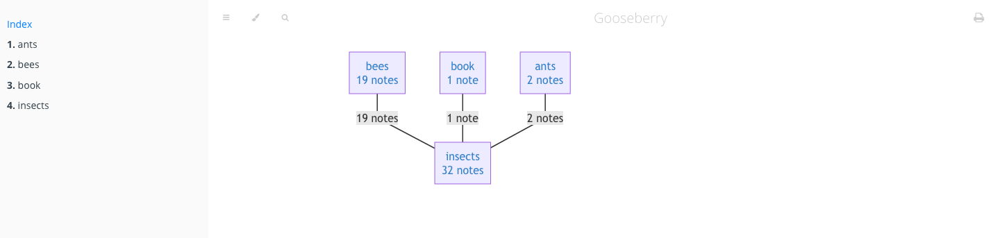

# Gooseberry - a Knowledge Base for the Lazy

**WIP**

Gooseberry combines [Hypothesis](https://web.hypothes.is/) (a tool to annotate the web)
 with [mdBook](https://rust-lang.github.io/mdBook/) (a tool to create a book from markdown files)
  in a command-line interface to generate a knowledge-base wiki without you having to actually type your knowledge out.

## Installation requirements
* [mdBook](https://rust-lang.github.io/mdBook/index.html) 
* [mdbook_mermaid](https://docs.rs/mdbook-mermaid/0.4.2/mdbook_mermaid/index.html)
* A Hypothesis account, and a personal API token obtained as described [here](https://h.readthedocs.io/en/latest/api/authorization/).
* [bat](https://github.com/sharkdp/bat) to display highlighted markdown in the terminal.
* clone this repository

## Contributing
See [CONTRIBUTING.md](CONTRIBUTING.md) for an in-depth explanation of how Gooseberry works and what could be improved. 

## Motivation
So yes, knowledge-base tools are old hat and a dime a dozen and we really have no excuse to not have a nice big 
tangled folder of markdown files filled with our overflowing wisdom. But after spending all day writing code and papers 
and tasks, it just isn't fair that our reading time also needs to be typing time to get all that knowledge down. 
And if we don't type things out our fancy knowledge-base is bare, empty, and sad. 

In comes Gooseberry - a tool to build a knowledge base from highlighting and annotating passages while reading news articles, 
blog posts, papers, what have you. Gooseberry combines the ease of annotation offered by 
[Hypothesis](https://web.hypothes.is/), bulk tagging and organization support in the command line, 
and a wonderfully interlinked wiki powered by [mdBook](https://rust-lang.github.io/mdBook/) so we'll never have knowledge-base starting troubles again! 

## A Typical Workflow
1. Find an article, blog post, paper etc. to read.
2. Highlight lines and facts you'd like to remember later. You can add comments and tags already if you're up for it but the focus can also be just on reading and highlighting without thinking too much about taking notes. 
3. More often than not, when one gets into a topic it ends in 50 open tabs of subtopics. This is fine, keep reading and highlighting away, we'll get back to this.
4. Finally, once your thirst for knowledge has been fulfilled, fire up a terminal and run 
   + `gooseberry sync` to download all your latest highlights and annotations.
   + `gooseberry tag --from "9a.m." topic` to tag everything you've read this morning with the topic you were looking into. 
   This subcommand is super flexible. You can tag something by a website, so that all annotations from subtopic B's wikipedia page are tagged as B for instance. 
   Or just open up search to fuzzy search your annotations and add tags to everything matching a search query. 
   Tags are very nestable, definitely make use of this - e.g. all annotations today may be about topic A, five of them are also subtopic B etc.
    + `gooseberry make` to add all this new tagged information to your knowledge base.

Here's an example. Today I read and annotated three articles about insects: this [Nautilus article titled "We need insects more than they need us"](https://nautil.us/issue/73/play/we-need-insects-more-than-they-need-us),
this [publication about honey bees and pesticides](https://journals.plos.org/plosone/article?id=10.1371/journal.pone.0070182), 
and [an Atlantic article about the "anternet"](https://www.theatlantic.com/technology/archive/2012/08/lessons-from-the-anternet-what-ants-and-computers-have-in-common/261580/).

I synced and tagged these annotations:

Then ran `gooseberry make` and `mdbook serve` to open the generated wiki in a browser. 
The front page has a graph of all tags, how they relate to each other, and how many notes are in each:

Each tag is clickable and leads to a page of annotations associated with it:

Annotation text is just markdown so text formatting, LaTeX, pictures etc. goes too!

Each annotation also links back to the position in the website that you got it from, if ever you feel like you're missing context. 

The last line in a tag's page lists related tags. 
TODO: You can also link annotations to each other directly, they'll show up as footnote-style links. 

## Some advantages
* You barely have to type while reading unless you're in the mood for taking notes.
* If you're in the mood, the note-taking won't involve window switching.
* Even without using the `mdBook` functionality you end up with a CLI to quickly tag your Hypothesis annotations.
* Even without using the tagging functionality you end up with a pretty cool, _searchable_ `mdBook` listing all your annotations. 
* Since it's just markdown you could even integrate it with other markdown-based KB systems or use it for non-annotation related notes with your editor of choice. 
  (TODO: this requires that gooseberry doesn't destroy user changes / overwrite markdown files)

## Why "Gooseberry"?
Because Discworld will never let me down when it comes to names:
[Dis-organizer Mark 5, the Gooseberry](https://wiki.lspace.org/mediawiki/Dis-organiser)
